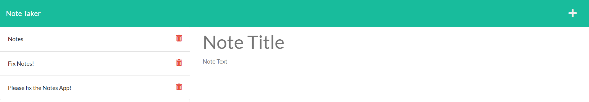

# Note-Taker-Project
## Description 
This application was created for individuals who want to write down and save notes in order to keep track of their tasks.

## Usage 
Anyone can use this application to track their daily tasks, all the user has to do is visit the website, insert the title of their task, the description, and click the "Save" button! 

## Installation 
N/A

## License
See repository.

## Contributing 
Nathan Perfetti - UofM Bootcamp class folder, Module 11 - Express, Activity -24

## Tests 
No tests performed.

## Questions
--GITHUB USERNAME--
ssangwang
--EMAIL--
sangw009@umn.edu